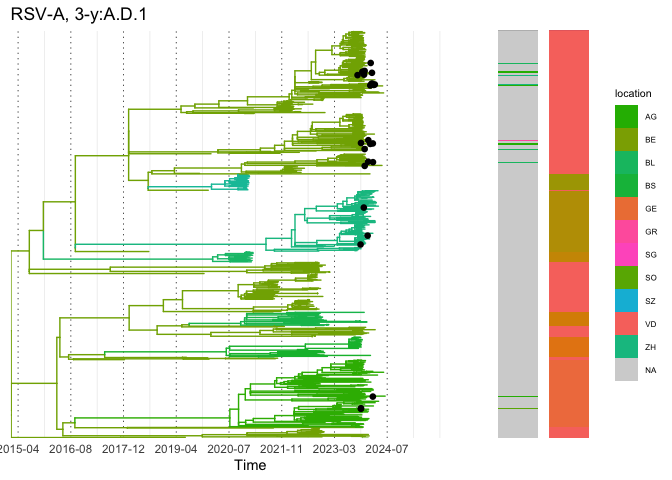
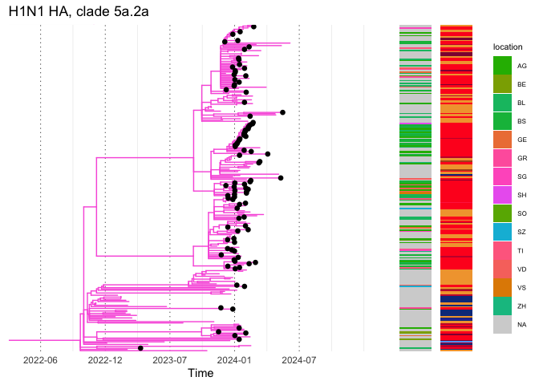

manuscript_public_code
================
2025-04-14

This is an R-markdown to completely re-generate the figures from the
ReVSeq Manuscript.

``` r
#sourcing all packages
library(dplyr)
```

    ## 
    ## Attaching package: 'dplyr'

    ## The following objects are masked from 'package:stats':
    ## 
    ##     filter, lag

    ## The following objects are masked from 'package:base':
    ## 
    ##     intersect, setdiff, setequal, union

``` r
library(stringr)
library(purrr)
library(ggplot2)
library(cowplot)
library(tidyr)
library(stringdist)
```

    ## 
    ## Attaching package: 'stringdist'

    ## The following object is masked from 'package:tidyr':
    ## 
    ##     extract

``` r
library(ggalluvial)
library(ggpubr)
```

    ## 
    ## Attaching package: 'ggpubr'

    ## The following object is masked from 'package:cowplot':
    ## 
    ##     get_legend

``` r
library(ggtree)
```

    ## ggtree v3.16.0 Learn more at https://yulab-smu.top/contribution-tree-data/
    ## 
    ## Please cite:
    ## 
    ## S Xu, Z Dai, P Guo, X Fu, S Liu, L Zhou, W Tang, T Feng, M Chen, L
    ## Zhan, T Wu, E Hu, Y Jiang, X Bo, G Yu. ggtreeExtra: Compact
    ## visualization of richly annotated phylogenetic data. Molecular Biology
    ## and Evolution. 2021, 38(9):4039-4042. doi: 10.1093/molbev/msab166

    ## 
    ## Attaching package: 'ggtree'

    ## The following object is masked from 'package:ggpubr':
    ## 
    ##     rotate

    ## The following object is masked from 'package:tidyr':
    ## 
    ##     expand

``` r
library(treeio)
```

    ## treeio v1.32.0 Learn more at https://yulab-smu.top/contribution-tree-data/
    ## 
    ## Please cite:
    ## 
    ## LG Wang, TTY Lam, S Xu, Z Dai, L Zhou, T Feng, P Guo, CW Dunn, BR
    ## Jones, T Bradley, H Zhu, Y Guan, Y Jiang, G Yu. treeio: an R package
    ## for phylogenetic tree input and output with richly annotated and
    ## associated data. Molecular Biology and Evolution. 2020, 37(2):599-603.
    ## doi: 10.1093/molbev/msz240

``` r
library(lubridate)
```

    ## 
    ## Attaching package: 'lubridate'

    ## The following object is masked from 'package:cowplot':
    ## 
    ##     stamp

    ## The following objects are masked from 'package:base':
    ## 
    ##     date, intersect, setdiff, union

``` r
library(aplot)
```

``` r
#sourcing all files 

#must upload virus abbreviation CSV

#overview 
source("Overview_circulating_viruses/fig_1_data_format.R")
source("Overview_circulating_viruses/fig_1_plot.R")

#PCR to seq comparison
source("Sequencing_results/fig_2_data_format.R")
source("Sequencing_results/fig_2_plot.R")

#co-infections
source("Sequencing_results/fig_3_data_format.R")
source("Sequencing_results/fig_3_plot.R")

#coverage plots
source("Sequencing_results/coverage_genome_data_format.R") 
source("Sequencing_results/coverage_genome_plot.R")

#tree plots
source("Phylogenetic_analysis/tree_plot.R")

#supplementary wastewater
source("Supplements/fig_s2_data_format.R")
source("Supplements/fig_s2_plot.R")
```

``` r
hq_data<-read.csv("Data/data/hq_data.csv")
pcr_data <- read.csv("Data/data/pcr_data.csv")
detected_data <- read.csv("Data/data/detected_data.csv")
sentinella_data <- get_sentinella_data()
```

# Figure 1: seasonal overview

``` r
substrains_to_highlight = ""
df_plt <- format_grid_pathogen_plot(hq_data, pcr=FALSE)
```

    ## `summarise()` has grouped output by 'date', 'substrain_name', 'line_positions',
    ## 'highlight_max'. You can override using the `.groups` argument.

``` r
freq_data<-format_frequencies_plot(pcr_data, hq_data, detected_data ,substrain_to_highlight = substrains_to_highlight)

#substrain_to highlight must be a vector
make_figure_one(df_plt, freq_data, sentinella_data ,highlight = FALSE, save=TRUE, pcr=FALSE )
```

<!-- --> \#
Figure 2: PCR / sequencing comparison

``` r
#all strains included in the PCR panel
pcr_panel_strains <- (pcr_data %>%  separate_rows(strains_PCR, panels_PCR, values_PCR, sep = ",\\s*") )$strains_PCR %>% unique()

formatted_pcr_to_detected<-format_pcr_to_detect_data(pcr_data, detected_data, pcr_panel_strains)
formatted_detected_to_hq<-format_detect_to_hq_data(detected_data, hq_data, pcr_panel_strains)

make_figure_comparison(formatted_pcr_to_detected, formatted_detected_to_hq, save=TRUE)
```

<!-- -->

# Figure 3: Co-infections in high-quality sequences

``` r
matrix_co <- format_matrix_co_infection_plot(hq_data)
percent_co <- format_percent_count_co_infection_plot(hq_data)

make_figure_3(matrix_co, percent_co, save=TRUE)
```

<!-- --> \#
Figure 4: Whole-genome coverage

``` r
# # RSV-A
# #get data
# virus_strain <- "Respiratory syncytial virus (type A)"
# rsv_a_data <- hq_data %>% filter(grepl(virus_strain, substrain_name, fixed=TRUE))
# 
# df <- format_coverage_plot_data(rsv_a_data, virus_strain)
# make_figure_coverage_genome(df, virus_strain, save=TRUE)
# 
# # Parainfluenza-3
# virus_strain <- "Human parainfluenza virus 3"
# hpiv_3_data <- hq_data %>% filter(grepl(virus_strain, substrain_name, fixed=TRUE))
# 
# df <- format_coverage_plot_data(hpiv_3_data, virus_strain)
# make_figure_coverage_genome(df, virus_strain, save=TRUE)
```

# Figure 5: Phylogenetic trees

## RSV-A

``` r
tree_file <- "Data/data/trees/nextstrain_rsv_a_genome_2y_timetree.nexus"
metadata_file <- "Data/data/trees/nextstrain_rsv_a_genome_2y_metadata.tsv"
tr <- read.mega(tree_file)
meta <- readr::read_tsv(metadata_file, show_col_types=FALSE)
```

``` r
#normal view
title ="RSV-A, 2-year"

tr@data <-tr@data %>% mutate( #database= ifelse(database=="ReVSeq", database, NA_character_),
                             location = ifelse(str_length(location)==2 & country=="Switzerland", location, NA_character_))
meta <- meta %>% mutate(location = ifelse(str_length(location)==2& country=="Switzerland", location, NA_character_),
                        strain = ifelse(is.na(database),strain, str_replace_all(strain, " ", "")),
                        accession =strain)


plot_tree_with_data(tr, meta, title  ,color_by="clade_membership", color_by_vertical = c("clade_membership", "region"), 
                    vertical_legend_on=c("clade_membership"=TRUE,"region"=FALSE),
                    vertical_plot_legend_columns = 2, 
                    zoomed= FALSE, save=TRUE, tree_legend_on=FALSE, date_format="%Y", tip_color = "database" )
```

    ## Rows: 266 Columns: 3
    ## ── Column specification ────────────────────────────────────────────────────────
    ## Delimiter: "\t"
    ## chr (3): object, key, color
    ## 
    ## ℹ Use `spec()` to retrieve the full column specification for this data.
    ## ℹ Specify the column types or set `show_col_types = FALSE` to quiet this message.

<!-- -->

``` r
#zoomed in
title ="RSV-A, 2-y:A.D.5"
plot_tree_with_data(tr, meta, title,  color_by="clade_membership", color_by_vertical = c("location", "clade_membership"),
                    vertical_legend_on=c("clade_membership"=FALSE,"location"=TRUE),
                    vertical_plot_legend_columns = 1,
                    zoomed= TRUE,tips_to_zoom = c("RSV-A/B_5zm4f4", "RSV-A/B_5azzpr"), axis_breaks = 40,
                    save=TRUE, tree_legend_on=FALSE, date_format="%Y-%m", tip_color = "database" )
```

    ## Rows: 266 Columns: 3
    ## ── Column specification ────────────────────────────────────────────────────────
    ## Delimiter: "\t"
    ## chr (3): object, key, color
    ## 
    ## ℹ Use `spec()` to retrieve the full column specification for this data.
    ## ℹ Specify the column types or set `show_col_types = FALSE` to quiet this message.

<!-- -->

``` r
#zoomed in
title ="RSV-A, 3-y:A.D.1"
plot_tree_with_data(tr, meta, title,  color_by="clade_membership", color_by_vertical = c("location", "clade_membership"),
                    vertical_legend_on=c("clade_membership"=FALSE,"location"=TRUE),
                    vertical_plot_legend_columns = 1,
                    zoomed= TRUE,tips_to_zoom = c("RSV-A/B_3rqlt3", "RSV-A/B_6qvq3m"), axis_breaks = 40,
                    save=TRUE, tree_legend_on=FALSE, date_format="%Y-%m", tip_color = "database" )
```

    ## Rows: 266 Columns: 3
    ## ── Column specification ────────────────────────────────────────────────────────
    ## Delimiter: "\t"
    ## chr (3): object, key, color
    ## 
    ## ℹ Use `spec()` to retrieve the full column specification for this data.
    ## ℹ Specify the column types or set `show_col_types = FALSE` to quiet this message.

<!-- -->

``` r
#zoomed in
title ="RSV-A, 3-y:A.D.3"
plot_tree_with_data(tr, meta, title,  color_by="clade_membership", color_by_vertical = c("location", "clade_membership"),
                    vertical_legend_on=c("clade_membership"=FALSE,"location"=TRUE),
                    vertical_plot_legend_columns = 1,
                    zoomed= TRUE,tips_to_zoom = c("RSV-A/B_15l1ha", "RSV-A/B_3ia4f7"), axis_breaks = 40,
                    save=TRUE, tree_legend_on=FALSE, date_format="%Y-%m", tip_color = "database" )
```

    ## Rows: 266 Columns: 3
    ## ── Column specification ────────────────────────────────────────────────────────
    ## Delimiter: "\t"
    ## chr (3): object, key, color
    ## 
    ## ℹ Use `spec()` to retrieve the full column specification for this data.
    ## ℹ Specify the column types or set `show_col_types = FALSE` to quiet this message.

<!-- -->

``` r
#phenetic distances between RSV-A and RSV-B

#load genetic distance trees
tree_file_a <- "Data/data/trees/div_nextstrain_rsv_a_genome_2y_tree.nexus"
tree_file_b <- "Data/data/trees/div_nextstrain_rsv_b_genome_2y_tree.nexus"
tr_a <- read.mega(tree_file_a)
tr_b <- read.mega(tree_file_b)
pat_mat_a<-cophenetic(tr_a@phylo)
pat_mat_b<-cophenetic(tr_b@phylo)


unique_distances_a <- pat_mat_a[lower.tri(pat_mat_a)]
unique_distances_b <- pat_mat_b[lower.tri(pat_mat_b)]

distance_df <- tibble(
  distance = c(unique_distances_a, unique_distances_b),
  source = c(rep("RSV-A", length(unique_distances_a)), rep("RSV-B", length(unique_distances_b)))
)

distance_df %>% group_by(source) %>% summarise(median= median(distance), IQR=IQR(distance))
```

    ## # A tibble: 2 × 3
    ##   source  median     IQR
    ##   <chr>    <dbl>   <dbl>
    ## 1 RSV-A  0.0191  0.0101 
    ## 2 RSV-B  0.00660 0.00205

## HPIV-3

``` r
tree_file <- "Data/data/trees/nextstrain_HPIV_3_whole_timetree.nexus"
metadata_file <- "Data/data/trees/nextstrain_HPIV_3_whole_metadata.tsv"
tr <- read.mega(tree_file)
meta <- readr::read_tsv(metadata_file, show_col_types=FALSE)
```

``` r
#normal view
title ="HPIV-3"
plot_tree_with_data(tr, meta, title  ,color_by="clade_membership", color_by_vertical = c("clade_membership", "region"), 
                    vertical_legend_on=c("clade_membership"=TRUE,"region"=TRUE),
                    vertical_plot_legend_columns = 1, 
                    zoomed= FALSE, save=TRUE, tree_legend_on=FALSE, 
                    date_format="%Y", tip_color = "database" )
```

    ## Rows: 266 Columns: 3
    ## ── Column specification ────────────────────────────────────────────────────────
    ## Delimiter: "\t"
    ## chr (3): object, key, color
    ## 
    ## ℹ Use `spec()` to retrieve the full column specification for this data.
    ## ℹ Specify the column types or set `show_col_types = FALSE` to quiet this message.

<!-- -->

``` r
#zoomed in 
title ="HPIV-3, clade 1"
plot_tree_with_data(tr, meta, title,  color_by="clade_membership", color_by_vertical = c("location", "region"), 
                    vertical_legend_on=c("region"=FALSE,"location"=TRUE),
                    vertical_plot_legend_columns = 1, 
                    zoomed= TRUE,tips_to_zoom = c("m2-jCKGBv", "m2-Y4rZ7q"), axis_breaks = 40, 
                    save=TRUE, tree_legend_on=FALSE, date_format="%Y-%m", tip_color = "location" )
```

    ## Rows: 266 Columns: 3
    ## ── Column specification ────────────────────────────────────────────────────────
    ## Delimiter: "\t"
    ## chr (3): object, key, color
    ## 
    ## ℹ Use `spec()` to retrieve the full column specification for this data.
    ## ℹ Specify the column types or set `show_col_types = FALSE` to quiet this message.
    ## Rows: 266 Columns: 3
    ## ── Column specification ────────────────────────────────────────────────────────
    ## Delimiter: "\t"
    ## chr (3): object, key, color
    ## 
    ## ℹ Use `spec()` to retrieve the full column specification for this data.
    ## ℹ Specify the column types or set `show_col_types = FALSE` to quiet this message.
    ## Rows: 266 Columns: 3
    ## ── Column specification ────────────────────────────────────────────────────────
    ## Delimiter: "\t"
    ## chr (3): object, key, color
    ## 
    ## ℹ Use `spec()` to retrieve the full column specification for this data.
    ## ℹ Specify the column types or set `show_col_types = FALSE` to quiet this message.

<!-- -->

``` r
title ="HPIV-3, clade 2"
plot_tree_with_data(tr, meta, title,  color_by="clade_membership",color_by_vertical = c("location", "region"), 
                    vertical_legend_on=c("region"=FALSE,"location"=TRUE),
                    vertical_plot_legend_columns = 1, 
                    zoomed= TRUE,tips_to_zoom = c("m2-9jS4Ro", "m2-SccDgj"), axis_breaks = 40, 
                    save=TRUE, tree_legend_on=FALSE, date_format="%Y-%m", tip_color = "location" )
```

    ## Rows: 266 Columns: 3
    ## ── Column specification ────────────────────────────────────────────────────────
    ## Delimiter: "\t"
    ## chr (3): object, key, color
    ## 
    ## ℹ Use `spec()` to retrieve the full column specification for this data.
    ## ℹ Specify the column types or set `show_col_types = FALSE` to quiet this message.
    ## Rows: 266 Columns: 3
    ## ── Column specification ────────────────────────────────────────────────────────
    ## Delimiter: "\t"
    ## chr (3): object, key, color
    ## 
    ## ℹ Use `spec()` to retrieve the full column specification for this data.
    ## ℹ Specify the column types or set `show_col_types = FALSE` to quiet this message.
    ## Rows: 266 Columns: 3
    ## ── Column specification ────────────────────────────────────────────────────────
    ## Delimiter: "\t"
    ## chr (3): object, key, color
    ## 
    ## ℹ Use `spec()` to retrieve the full column specification for this data.
    ## ℹ Specify the column types or set `show_col_types = FALSE` to quiet this message.

<!-- -->

# Table S2 virus counts by each testing type

``` r
df_pcr <-pcr_data %>% separate_longer_delim(cols = c(strains_PCR, panels_PCR, values_PCR), delim = ",") %>%
    # Remove leading/trailing whitespace
    mutate(strains_PCR = str_trim(strains_PCR),
           panels_PCR = str_trim(panels_PCR),
           values_PCR= str_trim(values_PCR)) %>% 
  mutate(
    panel_type = ifelse(grepl("resp", panels_PCR), "resp", ifelse(panels_PCR == "flua" | panels_PCR == "flub" | panels_PCR == "rspc", "p2", "p1"))
      ) %>% 
  filter(!is.na(strains_PCR)) %>% 
  dplyr::count(panel_type, strains_PCR)

df_detect <- detected_data %>% dplyr::count(strain_name)
df_hq <-hq_data %>% dplyr::count(strain_name)
```

# Figure S1, Figure S2: wastewater and sentinella correlations

``` r
sentinella_df <- get_sentinella_data() 
wastewater_df <- get_wastewater_data()
```

    ## `summarise()` has grouped output by 'date'. You can override using the
    ## `.groups` argument.

``` r
pathogens <- sentinella_df$pathogen_name %>% unique() %>% unlist()

pcr_dat_supp <- pcr_data %>% 
  separate_longer_delim(cols = c(strains_PCR, panels_PCR, values_PCR), delim = ",") %>%
    # Remove leading/trailing whitespace
  mutate(strains_PCR = str_trim(strains_PCR),
           panels_PCR = str_trim(panels_PCR),
           values_PCR= str_trim(values_PCR)) %>% 
  rename(substrain_name = strains_PCR)


pcr_dat<-format_grid_pathogen_plot(pcr_dat_supp, pcr=TRUE) %>% drop_na()
```

    ## `summarise()` has grouped output by 'date', 'substrain_name', 'line_positions',
    ## 'highlight_max'. You can override using the `.groups` argument.

``` r
detected_dat <- format_grid_pathogen_plot(detected_data, pcr=FALSE) %>% drop_na()
```

    ## `summarise()` has grouped output by 'date', 'substrain_name', 'line_positions',
    ## 'highlight_max'. You can override using the `.groups` argument.

``` r
sequencing_data <- format_grid_pathogen_plot(hq_data, pcr=FALSE) %>% drop_na()
```

    ## `summarise()` has grouped output by 'date', 'substrain_name', 'line_positions',
    ## 'highlight_max'. You can override using the `.groups` argument.

``` r
make_supplementary_figure_2(sentinella_df, pcr_dat, sequencing_data, detected_dat, wastewater_df , pathogens=pathogens ,save=TRUE)
```

    ## [1] "influenza_A"

    ## Adding missing grouping variables: `date`

    ## [1] "influenza_B"

    ## Adding missing grouping variables: `date`

    ## [1] "sars-cov-2"

    ## Adding missing grouping variables: `date`

    ## [1] "adenovirus"

    ## [1] "rhinovirus"

    ## [1] "respiratory_syncytial_virus"

    ## Adding missing grouping variables: `date`

    ## [1] "other"

    ## $corr

<!-- -->

    ## 
    ## $corr_ww

<!-- -->

# Figure S3 A,B,C

``` r
# # RSV-B
# #get data
# virus_strain <- "Human Respiratory syncytial virus 9320 (type B)"
# rsv_b_data <- hq_data %>% filter(grepl(virus_strain, substrain_name, fixed=TRUE))
# 
# df <- format_coverage_plot_data(rsv_b_data, virus_strain)
# make_figure_coverage_genome(df, virus_strain, save=TRUE)
# 
# # HMPV
# #get data
# virus_strain <- "metapneumovirus" 
# hmpv_data <- hq_data %>% filter(grepl(virus_strain, substrain_name, fixed=TRUE))
# 
# df <- format_coverage_plot_data(hmpv_data, virus_strain)
# make_figure_coverage_genome(df, virus_strain, save=TRUE)
```

``` r
#A/H1N1
# #get data
# virus_strain <- "2015(H1N1)"
# h1n1_data <- hq_data %>% filter(grepl(virus_strain, substrain_name, fixed=TRUE))
# 
# df <- format_coverage_plot_data(h1n1_data, virus_strain)
# figs<-make_figure_coverage_genome(df, virus_strain, save=FALSE)
# 
# 
# plots <- list( figs$h1n1_HA, figs$h1n1_NA)
# 
# plot_all<-plot_grid(plotlist = plots,
#           #nrow = length(virus_strains), 
#           ncol = 2,
#           rel_heights = c(1,1),
#           align = "v",
#           axis="l")
# 
# plot_all
# #ggsave("Figures/coverage_plots/h1n1_HA_NA.pdf",plot_all , dpi="retina", units="mm", width=174, height=123)
```

# Figure S4: RSV-B Phylogenetic trees

``` r
tree_file <- "Data/data/trees/nextstrain_rsv_b_genome_2y_timetree.nexus"
metadata_file <- "Data/data/trees/nextstrain_rsv_b_genome_2y_metadata.tsv"
tr <- read.mega(tree_file)
meta <- readr::read_tsv(metadata_file, show_col_types=FALSE)
```

``` r
#normal view
title ="RSV-B, 2-year"

tr@data <-tr@data %>% mutate( #database= ifelse(database=="ReVSeq", database, NA_character_),
                             location = ifelse(str_length(location)==2 & country=="Switzerland", location, NA_character_))
meta <- meta %>% mutate(location = ifelse(str_length(location)==2& country=="Switzerland", location, NA_character_),
                        strain = ifelse(is.na(database),strain, str_replace_all(strain, " ", "")),
                        accession =strain)


plot_tree_with_data(tr, meta, title  ,color_by="clade_membership", color_by_vertical = c("clade_membership", "region"), 
                    vertical_legend_on=c("clade_membership"=TRUE,"region"=TRUE),
                    vertical_plot_legend_columns = 2, 
                    zoomed= FALSE, save=TRUE, tree_legend_on=FALSE, date_format="%Y", tip_color = "database" )
```

    ## Rows: 266 Columns: 3
    ## ── Column specification ────────────────────────────────────────────────────────
    ## Delimiter: "\t"
    ## chr (3): object, key, color
    ## 
    ## ℹ Use `spec()` to retrieve the full column specification for this data.
    ## ℹ Specify the column types or set `show_col_types = FALSE` to quiet this message.

<!-- -->

# Figure S5: A/H1N1/HA Phylogenetic trees

``` r
tree_file <- "Data/data/trees/nextstrain_h1n1_HA_timetree.nexus"
metadata_file <- "Data/data/trees/nextstrain_h1n1_HA_metadata.tsv"
tr <- read.mega(tree_file)
meta <- readr::read_tsv(metadata_file, show_col_types=FALSE)
```

``` r
#normal view
title ="H1N1 HA"
plot_tree_with_data(tr, meta, title  ,color_by="clade_membership", color_by_vertical = c("clade_membership", "region"), 
                    vertical_legend_on=c("clade_membership"=TRUE,"region"=FALSE),
                    vertical_plot_legend_columns = 1, 
                    zoomed= FALSE, save=TRUE, tree_legend_on=FALSE, date_format="%Y", tip_color = "database" )
```

    ## Rows: 266 Columns: 3
    ## ── Column specification ────────────────────────────────────────────────────────
    ## Delimiter: "\t"
    ## chr (3): object, key, color
    ## 
    ## ℹ Use `spec()` to retrieve the full column specification for this data.
    ## ℹ Specify the column types or set `show_col_types = FALSE` to quiet this message.

<!-- -->

``` r
#zoomed in 
title ="H1N1 HA, clade 5a.2a"
plot_tree_with_data(tr, meta, title,  color_by="clade_membership", color_by_vertical = c("location", "country"), 
                    vertical_legend_on=c("country"=FALSE,"location"=TRUE),
                    vertical_plot_legend_columns = 1, 
                    zoomed= TRUE,tips_to_zoom = c("m2-4SnyCD", "m2-sFFUfJ"), axis_breaks = 30, 
                    save=TRUE, tree_legend_on=FALSE, date_format="%Y-%m", tip_color = "database" )
```

    ## Rows: 266 Columns: 3
    ## ── Column specification ────────────────────────────────────────────────────────
    ## Delimiter: "\t"
    ## chr (3): object, key, color
    ## 
    ## ℹ Use `spec()` to retrieve the full column specification for this data.
    ## ℹ Specify the column types or set `show_col_types = FALSE` to quiet this message.
    ## Rows: 266 Columns: 3
    ## ── Column specification ────────────────────────────────────────────────────────
    ## Delimiter: "\t"
    ## chr (3): object, key, color
    ## 
    ## ℹ Use `spec()` to retrieve the full column specification for this data.
    ## ℹ Specify the column types or set `show_col_types = FALSE` to quiet this message.

<!-- -->

``` r
title ="H1N1 HA, clade 5a.2a.1"
plot_tree_with_data(tr, meta, title,  color_by="clade_membership", color_by_vertical = c("location", "country"), 
                    vertical_legend_on=c("country"=FALSE,"location"=TRUE),
                    vertical_plot_legend_columns = 1, 
                    zoomed= TRUE,tips_to_zoom = c("m2-3qDrEd", "m2-qeHUBn"), axis_breaks = 30, 
                    save=TRUE, tree_legend_on=FALSE, date_format="%Y-%m",tip_color = "database"  )
```

    ## Rows: 266 Columns: 3
    ## ── Column specification ────────────────────────────────────────────────────────
    ## Delimiter: "\t"
    ## chr (3): object, key, color
    ## 
    ## ℹ Use `spec()` to retrieve the full column specification for this data.
    ## ℹ Specify the column types or set `show_col_types = FALSE` to quiet this message.
    ## Rows: 266 Columns: 3
    ## ── Column specification ────────────────────────────────────────────────────────
    ## Delimiter: "\t"
    ## chr (3): object, key, color
    ## 
    ## ℹ Use `spec()` to retrieve the full column specification for this data.
    ## ℹ Specify the column types or set `show_col_types = FALSE` to quiet this message.

<!-- -->

``` r
title ="variant expanding"
plot_tree_with_data(tr, meta, title,  color_by="clade_membership", color_by_vertical =c("location", "country"), 
                    vertical_legend_on=c("country"=FALSE,"location"=TRUE),
                    vertical_plot_legend_columns = 1, 
                    zoomed= TRUE,tips_to_zoom = c("m2-5cJWyf", "m2-kNU7js"), axis_breaks = 30, 
                    save=TRUE, tree_legend_on=FALSE, date_format="%Y-%m",tip_color = "database"  )
```

    ## Rows: 266 Columns: 3
    ## ── Column specification ────────────────────────────────────────────────────────
    ## Delimiter: "\t"
    ## chr (3): object, key, color
    ## 
    ## ℹ Use `spec()` to retrieve the full column specification for this data.
    ## ℹ Specify the column types or set `show_col_types = FALSE` to quiet this message.
    ## Rows: 266 Columns: 3
    ## ── Column specification ────────────────────────────────────────────────────────
    ## Delimiter: "\t"
    ## chr (3): object, key, color
    ## 
    ## ℹ Use `spec()` to retrieve the full column specification for this data.
    ## ℹ Specify the column types or set `show_col_types = FALSE` to quiet this message.

<!-- -->
