Coverage plots for all single-stranded viruses
================
2025-07-02

``` r
#sourcing all packages
library(dplyr)
```

    ## 
    ## Attaching package: 'dplyr'

    ## The following objects are masked from 'package:stats':
    ## 
    ##     filter, lag

    ## The following objects are masked from 'package:base':
    ## 
    ##     intersect, setdiff, setequal, union

``` r
library(stringr)
library(purrr)
library(ggplot2)
library(cowplot)
library(tidyr)
library(ggpubr)
```

    ## 
    ## Attaching package: 'ggpubr'

    ## The following object is masked from 'package:cowplot':
    ## 
    ##     get_legend

``` r
#sourcing functions for plotting

#coverage plots
source("Sequencing_results/coverage_genome_data_format.R") #requires external docs > to add (bedfile and gff files)
source("Sequencing_results/coverage_genome_plot.R")
```

``` r
#data set needed
hq_data<-read.csv("Data/data/hq_data.csv")
```

# RSV-A

``` r
# RSV-A
#get data
virus_strain <- "Respiratory syncytial virus (type A)"
rsv_a_data <- hq_data %>% filter(grepl(virus_strain, substrain_name, fixed=TRUE))

df <- format_coverage_plot_data(rsv_a_data, virus_strain)
make_figure_coverage_genome(df, virus_strain, save=FALSE)
```

    ## Rows: 14 Columns: 9
    ## ── Column specification ────────────────────────────────────────────────────────
    ## Delimiter: "\t"
    ## chr (7): X1, X2, X3, X6, X7, X8, X9
    ## dbl (2): X4, X5
    ## 
    ## ℹ Use `spec()` to retrieve the full column specification for this data.
    ## ℹ Specify the column types or set `show_col_types = FALSE` to quiet this message.

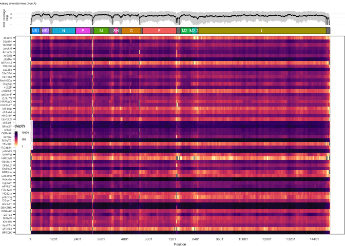<!-- -->

# RSV-B

``` r
# RSV-B
#get data
virus_strain <- "Human Respiratory syncytial virus 9320 (type B)"
rsv_b_data <- hq_data %>% filter(grepl(virus_strain, substrain_name, fixed=TRUE))

df <- format_coverage_plot_data(rsv_b_data, virus_strain)
make_figure_coverage_genome(df, virus_strain, save=FALSE)
```

    ## Rows: 12 Columns: 9
    ## ── Column specification ────────────────────────────────────────────────────────
    ## Delimiter: "\t"
    ## chr (7): X1, X2, X3, X6, X7, X8, X9
    ## dbl (2): X4, X5
    ## 
    ## ℹ Use `spec()` to retrieve the full column specification for this data.
    ## ℹ Specify the column types or set `show_col_types = FALSE` to quiet this message.

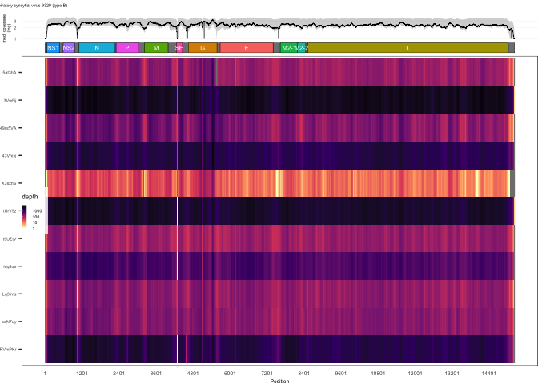<!-- -->

# HPIV-3

``` r
# Parainfluenza-3
virus_strain <- "Human parainfluenza virus 3"
hpiv_3_data <- hq_data %>% filter(grepl(virus_strain, substrain_name, fixed=TRUE))

df <- format_coverage_plot_data(hpiv_3_data, virus_strain)
make_figure_coverage_genome(df, virus_strain, save=FALSE)
```

    ## Rows: 7 Columns: 9
    ## ── Column specification ────────────────────────────────────────────────────────
    ## Delimiter: "\t"
    ## chr (7): X1, X2, X3, X6, X7, X8, X9
    ## dbl (2): X4, X5
    ## 
    ## ℹ Use `spec()` to retrieve the full column specification for this data.
    ## ℹ Specify the column types or set `show_col_types = FALSE` to quiet this message.

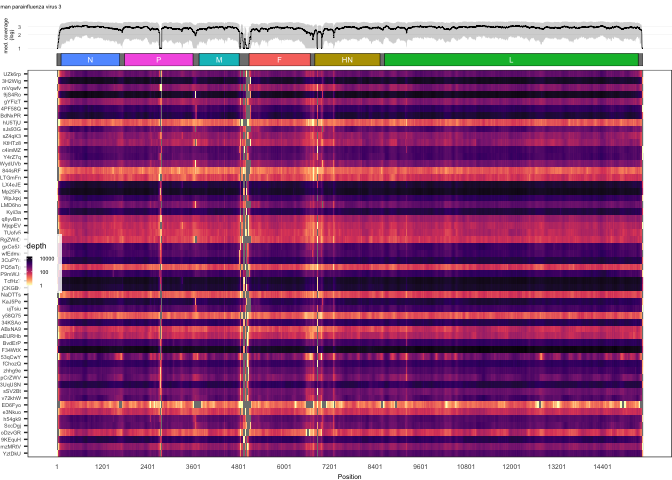<!-- -->

# HPIV-2

``` r
# Parainfluenza-2
virus_strain <- "Human parainfluenza virus 2"
hpiv_2_data <- hq_data %>% filter(grepl(virus_strain, substrain_name, fixed=TRUE))

df <- format_coverage_plot_data(hpiv_2_data, virus_strain)
make_figure_coverage_genome(df, virus_strain, save=FALSE)
```

    ## Rows: 9 Columns: 9
    ## ── Column specification ────────────────────────────────────────────────────────
    ## Delimiter: "\t"
    ## chr (7): X1, X2, X3, X6, X7, X8, X9
    ## dbl (2): X4, X5
    ## 
    ## ℹ Use `spec()` to retrieve the full column specification for this data.
    ## ℹ Specify the column types or set `show_col_types = FALSE` to quiet this message.

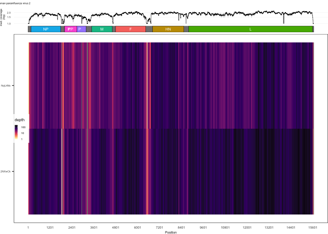<!-- -->

# HPIV-1

``` r
# Parainfluenza-1
virus_strain <- "Human parainfluenza virus 1"
hpiv_1_data <- hq_data %>% filter(grepl(virus_strain, substrain_name, fixed=TRUE))

df <- format_coverage_plot_data(hpiv_1_data, virus_strain)
make_figure_coverage_genome(df, virus_strain, save=FALSE)
```

    ## Rows: 11 Columns: 9
    ## ── Column specification ────────────────────────────────────────────────────────
    ## Delimiter: "\t"
    ## chr (7): X1, X2, X3, X6, X7, X8, X9
    ## dbl (2): X4, X5
    ## 
    ## ℹ Use `spec()` to retrieve the full column specification for this data.
    ## ℹ Specify the column types or set `show_col_types = FALSE` to quiet this message.

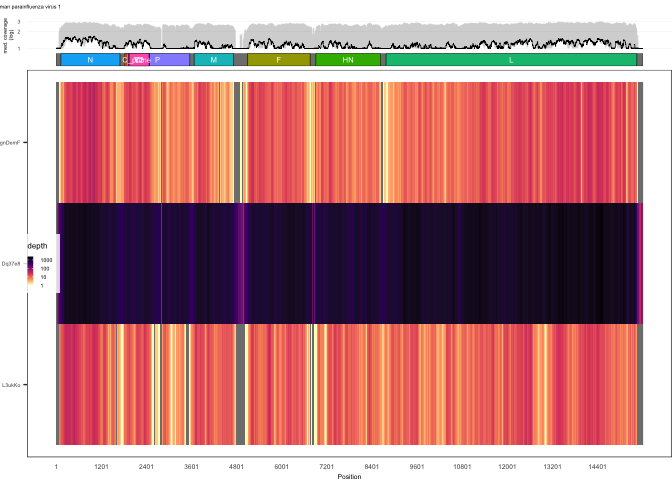<!-- -->

\#SARS-CoV-2

``` r
virus_strain <- "SARS-CoV-2"
sars_data <- hq_data %>% filter(grepl(virus_strain, substrain_name, fixed=TRUE))

df <- format_coverage_plot_data(sars_data, virus_strain)
make_figure_coverage_genome(df, virus_strain, save=FALSE)
```

    ## Rows: 12 Columns: 9
    ## ── Column specification ────────────────────────────────────────────────────────
    ## Delimiter: "\t"
    ## chr (7): X1, X2, X3, X6, X7, X8, X9
    ## dbl (2): X4, X5
    ## 
    ## ℹ Use `spec()` to retrieve the full column specification for this data.
    ## ℹ Specify the column types or set `show_col_types = FALSE` to quiet this message.

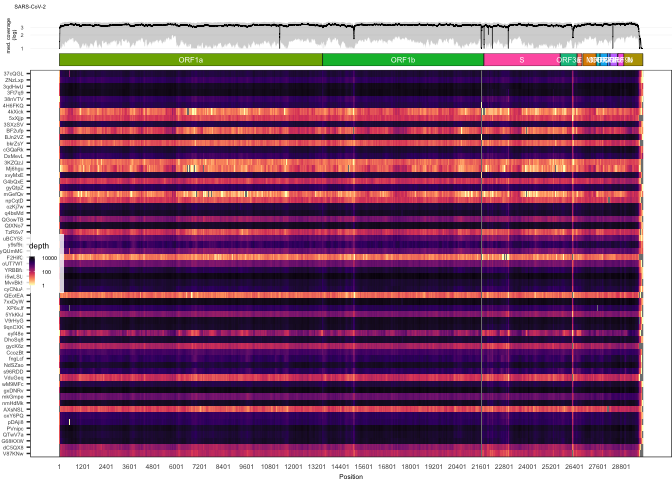<!-- -->

# HMPV

``` r
# HMPV
#get data
virus_strain <- "metapneumovirus" 
hmpv_data <- hq_data %>% filter(grepl(virus_strain, substrain_name, fixed=TRUE))

df <- format_coverage_plot_data(hmpv_data, virus_strain)
make_figure_coverage_genome(df, virus_strain, save=FALSE)
```

    ## Rows: 10 Columns: 9
    ## ── Column specification ────────────────────────────────────────────────────────
    ## Delimiter: "\t"
    ## chr (7): X1, X2, X3, X6, X7, X8, X9
    ## dbl (2): X4, X5
    ## 
    ## ℹ Use `spec()` to retrieve the full column specification for this data.
    ## ℹ Specify the column types or set `show_col_types = FALSE` to quiet this message.

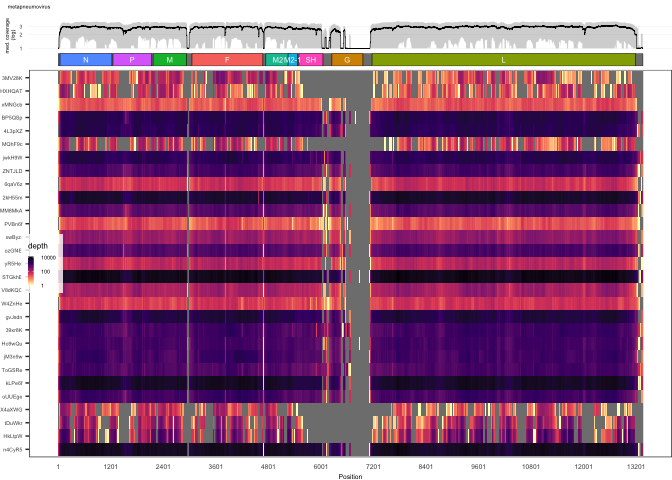<!-- -->

# A/H1N1 HA/NA segments

``` r
#H1N1
#get data
virus_strain <- "2015(H1N1)"
h1n1_data <- hq_data %>% filter(grepl(virus_strain, substrain_name, fixed=TRUE))

df <- format_coverage_plot_data(h1n1_data, virus_strain)
figs<-make_figure_coverage_genome(df, virus_strain, save=FALSE)
```

    ## Rows: 2 Columns: 9
    ## ── Column specification ────────────────────────────────────────────────────────
    ## Delimiter: "\t"
    ## chr (7): X1, X2, X3, X6, X7, X8, X9
    ## dbl (2): X4, X5
    ## 
    ## ℹ Use `spec()` to retrieve the full column specification for this data.
    ## ℹ Specify the column types or set `show_col_types = FALSE` to quiet this message.
    ## Rows: 3 Columns: 9
    ## ── Column specification ────────────────────────────────────────────────────────
    ## Delimiter: "\t"
    ## chr (6): X1, X2, X3, X6, X7, X9
    ## dbl (3): X4, X5, X8
    ## 
    ## ℹ Use `spec()` to retrieve the full column specification for this data.
    ## ℹ Specify the column types or set `show_col_types = FALSE` to quiet this message.
    ## Rows: 1 Columns: 9
    ## ── Column specification ────────────────────────────────────────────────────────
    ## Delimiter: "\t"
    ## chr (6): X1, X2, X3, X6, X7, X9
    ## dbl (3): X4, X5, X8
    ## 
    ## ℹ Use `spec()` to retrieve the full column specification for this data.
    ## ℹ Specify the column types or set `show_col_types = FALSE` to quiet this message.
    ## Rows: 1 Columns: 9
    ## ── Column specification ────────────────────────────────────────────────────────
    ## Delimiter: "\t"
    ## chr (6): X1, X2, X3, X6, X7, X9
    ## dbl (3): X4, X5, X8
    ## 
    ## ℹ Use `spec()` to retrieve the full column specification for this data.
    ## ℹ Specify the column types or set `show_col_types = FALSE` to quiet this message.
    ## Rows: 1 Columns: 9
    ## ── Column specification ────────────────────────────────────────────────────────
    ## Delimiter: "\t"
    ## chr (6): X1, X2, X3, X6, X7, X9
    ## dbl (3): X4, X5, X8
    ## 
    ## ℹ Use `spec()` to retrieve the full column specification for this data.
    ## ℹ Specify the column types or set `show_col_types = FALSE` to quiet this message.
    ## Rows: 1 Columns: 9
    ## ── Column specification ────────────────────────────────────────────────────────
    ## Delimiter: "\t"
    ## chr (6): X1, X2, X3, X6, X7, X9
    ## dbl (3): X4, X5, X8
    ## 
    ## ℹ Use `spec()` to retrieve the full column specification for this data.
    ## ℹ Specify the column types or set `show_col_types = FALSE` to quiet this message.
    ## Rows: 3 Columns: 9
    ## ── Column specification ────────────────────────────────────────────────────────
    ## Delimiter: "\t"
    ## chr (7): X1, X2, X3, X6, X7, X8, X9
    ## dbl (2): X4, X5
    ## 
    ## ℹ Use `spec()` to retrieve the full column specification for this data.
    ## ℹ Specify the column types or set `show_col_types = FALSE` to quiet this message.
    ## Rows: 1 Columns: 9
    ## ── Column specification ────────────────────────────────────────────────────────
    ## Delimiter: "\t"
    ## chr (6): X1, X2, X3, X6, X7, X9
    ## dbl (3): X4, X5, X8
    ## 
    ## ℹ Use `spec()` to retrieve the full column specification for this data.
    ## ℹ Specify the column types or set `show_col_types = FALSE` to quiet this message.

``` r
plots <- list( figs$h1n1_HA, figs$h1n1_NA)

plot_all<-plot_grid(plotlist = plots,
          #nrow = length(virus_strains), 
          ncol = 2,
          rel_heights = c(1,1),
          align = "v",
          axis="l")

plot_all
```

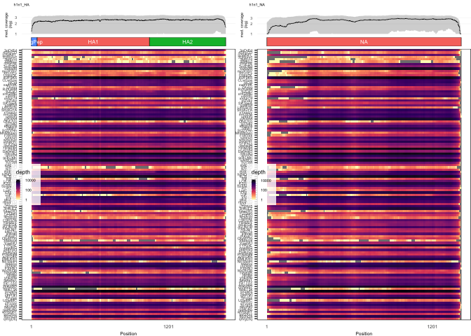<!-- -->

# A/H3N2 HA/NA segments

``` r
#H3N2
#get data
virus_strain <- "2012(H3N2)"
h3n2_data <- hq_data %>% filter(grepl(virus_strain, substrain_name, fixed=TRUE))

df <- format_coverage_plot_data(h3n2_data, virus_strain)
figs<-make_figure_coverage_genome(df, virus_strain, save=FALSE)
```

    ## Rows: 1 Columns: 9
    ## ── Column specification ────────────────────────────────────────────────────────
    ## Delimiter: "\t"
    ## chr (6): X1, X2, X3, X6, X7, X9
    ## dbl (3): X4, X5, X8
    ## 
    ## ℹ Use `spec()` to retrieve the full column specification for this data.
    ## ℹ Specify the column types or set `show_col_types = FALSE` to quiet this message.
    ## Rows: 1 Columns: 9
    ## ── Column specification ────────────────────────────────────────────────────────
    ## Delimiter: "\t"
    ## chr (6): X1, X2, X3, X6, X7, X9
    ## dbl (3): X4, X5, X8
    ## 
    ## ℹ Use `spec()` to retrieve the full column specification for this data.
    ## ℹ Specify the column types or set `show_col_types = FALSE` to quiet this message.
    ## Rows: 4 Columns: 9
    ## ── Column specification ────────────────────────────────────────────────────────
    ## Delimiter: "\t"
    ## chr (7): X1, X2, X3, X6, X7, X8, X9
    ## dbl (2): X4, X5
    ## 
    ## ℹ Use `spec()` to retrieve the full column specification for this data.
    ## ℹ Specify the column types or set `show_col_types = FALSE` to quiet this message.
    ## Rows: 1 Columns: 9
    ## ── Column specification ────────────────────────────────────────────────────────
    ## Delimiter: "\t"
    ## chr (6): X1, X2, X3, X6, X7, X9
    ## dbl (3): X4, X5, X8
    ## 
    ## ℹ Use `spec()` to retrieve the full column specification for this data.
    ## ℹ Specify the column types or set `show_col_types = FALSE` to quiet this message.
    ## Rows: 2 Columns: 9
    ## ── Column specification ────────────────────────────────────────────────────────
    ## Delimiter: "\t"
    ## chr (6): X1, X2, X3, X6, X7, X9
    ## dbl (3): X4, X5, X8
    ## 
    ## ℹ Use `spec()` to retrieve the full column specification for this data.
    ## ℹ Specify the column types or set `show_col_types = FALSE` to quiet this message.
    ## Rows: 3 Columns: 9
    ## ── Column specification ────────────────────────────────────────────────────────
    ## Delimiter: "\t"
    ## chr (7): X1, X2, X3, X6, X7, X8, X9
    ## dbl (2): X4, X5
    ## 
    ## ℹ Use `spec()` to retrieve the full column specification for this data.
    ## ℹ Specify the column types or set `show_col_types = FALSE` to quiet this message.
    ## Rows: 1 Columns: 9
    ## ── Column specification ────────────────────────────────────────────────────────
    ## Delimiter: "\t"
    ## chr (6): X1, X2, X3, X6, X7, X9
    ## dbl (3): X4, X5, X8
    ## 
    ## ℹ Use `spec()` to retrieve the full column specification for this data.
    ## ℹ Specify the column types or set `show_col_types = FALSE` to quiet this message.
    ## Rows: 3 Columns: 9
    ## ── Column specification ────────────────────────────────────────────────────────
    ## Delimiter: "\t"
    ## chr (6): X1, X2, X3, X6, X7, X9
    ## dbl (3): X4, X5, X8
    ## 
    ## ℹ Use `spec()` to retrieve the full column specification for this data.
    ## ℹ Specify the column types or set `show_col_types = FALSE` to quiet this message.

``` r
plots <- list( figs$h3n2_HA, figs$h3n2_NA)

plot_all<-plot_grid(plotlist = plots,
          #nrow = length(virus_strains), 
          ncol = 2,
          rel_heights = c(1,1),
          align = "v",
          axis="l")

plot_all
```

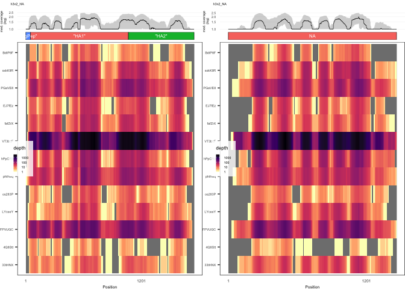<!-- -->

# B/Victoria

``` r
#B/Victoria
#get data
virus_strain <- "B/Brisbane"
vic_data <- hq_data %>% filter(grepl(virus_strain, substrain_name, fixed=TRUE))

df <- format_coverage_plot_data(vic_data, virus_strain)
figs<-make_figure_coverage_genome(df, virus_strain, save=FALSE)
```

    ## Rows: 4 Columns: 9
    ## ── Column specification ────────────────────────────────────────────────────────
    ## Delimiter: "\t"
    ## chr (7): X1, X2, X3, X6, X7, X8, X9
    ## dbl (2): X4, X5
    ## 
    ## ℹ Use `spec()` to retrieve the full column specification for this data.
    ## ℹ Specify the column types or set `show_col_types = FALSE` to quiet this message.
    ## Rows: 3 Columns: 9
    ## ── Column specification ────────────────────────────────────────────────────────
    ## Delimiter: "\t"
    ## chr (7): X1, X2, X3, X6, X7, X8, X9
    ## dbl (2): X4, X5
    ## 
    ## ℹ Use `spec()` to retrieve the full column specification for this data.
    ## ℹ Specify the column types or set `show_col_types = FALSE` to quiet this message.
    ## Rows: 2 Columns: 9
    ## ── Column specification ────────────────────────────────────────────────────────
    ## Delimiter: "\t"
    ## chr (7): X1, X2, X3, X6, X7, X8, X9
    ## dbl (2): X4, X5
    ## 
    ## ℹ Use `spec()` to retrieve the full column specification for this data.
    ## ℹ Specify the column types or set `show_col_types = FALSE` to quiet this message.
    ## Rows: 2 Columns: 9
    ## ── Column specification ────────────────────────────────────────────────────────
    ## Delimiter: "\t"
    ## chr (7): X1, X2, X3, X6, X7, X8, X9
    ## dbl (2): X4, X5
    ## 
    ## ℹ Use `spec()` to retrieve the full column specification for this data.
    ## ℹ Specify the column types or set `show_col_types = FALSE` to quiet this message.
    ## Rows: 2 Columns: 9
    ## ── Column specification ────────────────────────────────────────────────────────
    ## Delimiter: "\t"
    ## chr (7): X1, X2, X3, X6, X7, X8, X9
    ## dbl (2): X4, X5
    ## 
    ## ℹ Use `spec()` to retrieve the full column specification for this data.
    ## ℹ Specify the column types or set `show_col_types = FALSE` to quiet this message.
    ## Rows: 2 Columns: 9
    ## ── Column specification ────────────────────────────────────────────────────────
    ## Delimiter: "\t"
    ## chr (7): X1, X2, X3, X6, X7, X8, X9
    ## dbl (2): X4, X5
    ## 
    ## ℹ Use `spec()` to retrieve the full column specification for this data.
    ## ℹ Specify the column types or set `show_col_types = FALSE` to quiet this message.
    ## Rows: 3 Columns: 9
    ## ── Column specification ────────────────────────────────────────────────────────
    ## Delimiter: "\t"
    ## chr (7): X1, X2, X3, X6, X7, X8, X9
    ## dbl (2): X4, X5
    ## 
    ## ℹ Use `spec()` to retrieve the full column specification for this data.
    ## ℹ Specify the column types or set `show_col_types = FALSE` to quiet this message.

``` r
plots <- list( figs$vic_HA, figs$vic_NA)

plot_all<-plot_grid(plotlist = plots,
          #nrow = length(virus_strains), 
          ncol = 2,
          rel_heights = c(1,1),
          align = "v",
          axis="l")

plot_all
```

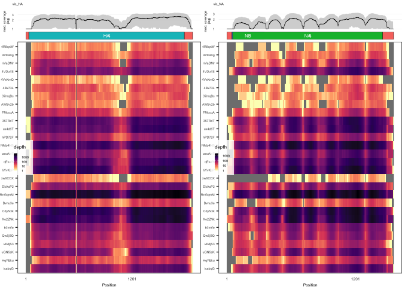<!-- -->

# HKU1

``` r
# seasonal coronavirus HKU1
virus_strain <- "HKU1"
hku1_data <- hq_data %>% filter(grepl(virus_strain, substrain_name, fixed=TRUE))

df <- format_coverage_plot_data(hku1_data, virus_strain)
make_figure_coverage_genome(df, virus_strain, save=FALSE)
```

    ## Rows: 11 Columns: 9
    ## ── Column specification ────────────────────────────────────────────────────────
    ## Delimiter: "\t"
    ## chr (7): X1, X2, X3, X6, X7, X8, X9
    ## dbl (2): X4, X5
    ## 
    ## ℹ Use `spec()` to retrieve the full column specification for this data.
    ## ℹ Specify the column types or set `show_col_types = FALSE` to quiet this message.

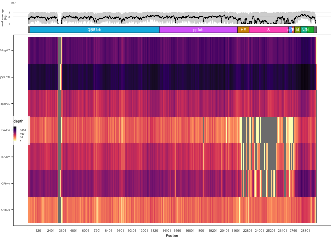<!-- -->

# OC43

``` r
# seasonal coronavirus OC43
virus_strain <- "OC43"
oc43_data <- hq_data %>% filter(grepl(virus_strain, substrain_name, fixed=TRUE))

df <- format_coverage_plot_data(oc43_data, virus_strain)
make_figure_coverage_genome(df, virus_strain, save=FALSE)
```

    ## Rows: 11 Columns: 9
    ## ── Column specification ────────────────────────────────────────────────────────
    ## Delimiter: "\t"
    ## chr (7): X1, X2, X3, X6, X7, X8, X9
    ## dbl (2): X4, X5
    ## 
    ## ℹ Use `spec()` to retrieve the full column specification for this data.
    ## ℹ Specify the column types or set `show_col_types = FALSE` to quiet this message.

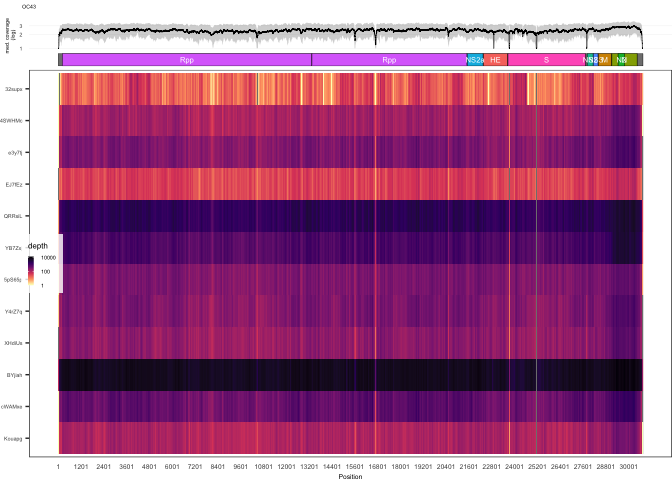<!-- -->

# NL63

``` r
# seasonal coronavirus NL63
virus_strain <- "NL63"
nl63_data <- hq_data %>% filter(grepl(virus_strain, substrain_name, fixed=TRUE))

df <- format_coverage_plot_data(nl63_data, virus_strain)
make_figure_coverage_genome(df, virus_strain, save=FALSE)
```

    ## Rows: 9 Columns: 9
    ## ── Column specification ────────────────────────────────────────────────────────
    ## Delimiter: "\t"
    ## chr (7): X1, X2, X3, X6, X7, X8, X9
    ## dbl (2): X4, X5
    ## 
    ## ℹ Use `spec()` to retrieve the full column specification for this data.
    ## ℹ Specify the column types or set `show_col_types = FALSE` to quiet this message.

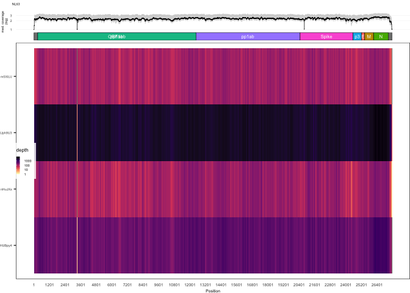<!-- -->

# 229E

``` r
# seasonal coronavirus 229E
virus_strain <- "229E"
e229_data <- hq_data %>% filter(grepl(virus_strain, substrain_name, fixed=TRUE))

df <- format_coverage_plot_data(e229_data, virus_strain)
make_figure_coverage_genome(df, virus_strain, save=FALSE)
```

    ## Rows: 10 Columns: 9
    ## ── Column specification ────────────────────────────────────────────────────────
    ## Delimiter: "\t"
    ## chr (7): X1, X2, X3, X6, X7, X8, X9
    ## dbl (2): X4, X5
    ## 
    ## ℹ Use `spec()` to retrieve the full column specification for this data.
    ## ℹ Specify the column types or set `show_col_types = FALSE` to quiet this message.

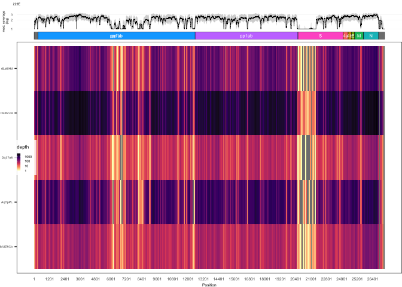<!-- -->
